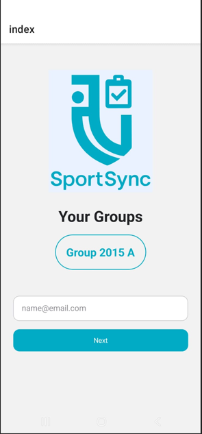

SportSync

SportSync is an application for monitoring attendance and payments in sports sections.

Features
Track attendance of athletes in different sections.
Manage payments and payment history.
Generate reports on attendance and finances.
User-friendly interface for coaches and administrators.

Tech Stack
Frontend: React Native
Backend: Node.js / Express
Database: MySQL

Usage
Sign up or log in.
Add sports sections and participants.
Record attendance and payments.
Generate reports for analysis.

License
MIT License

