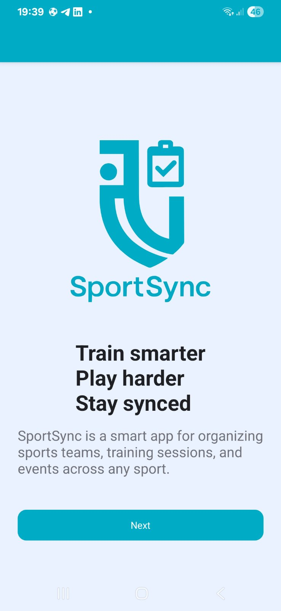
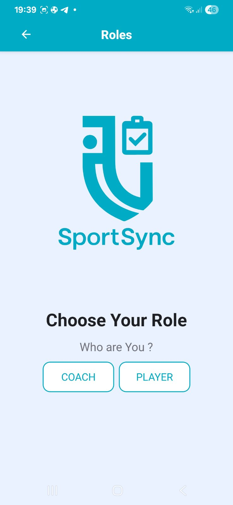

# SportSync

**SportSync** is an application for monitoring attendance and payments in sports sections.

## Features

- Track attendance of athletes in different sections.
- Manage payments and payment history.
- Generate reports on attendance and finances.
- User-friendly interface for coaches and players.

## Tech Stack

- **Frontend:** React Native
- **Backend:** Node.js / Express
- **Database:** MySQL

## Usage

1. Sign up or log in.
2. Add sports sections and participants.
3. Record attendance and payments.
4. Generate reports for analysis.

## License

This project is licensed under the [MIT License](LICENSE).

## Screenshots

